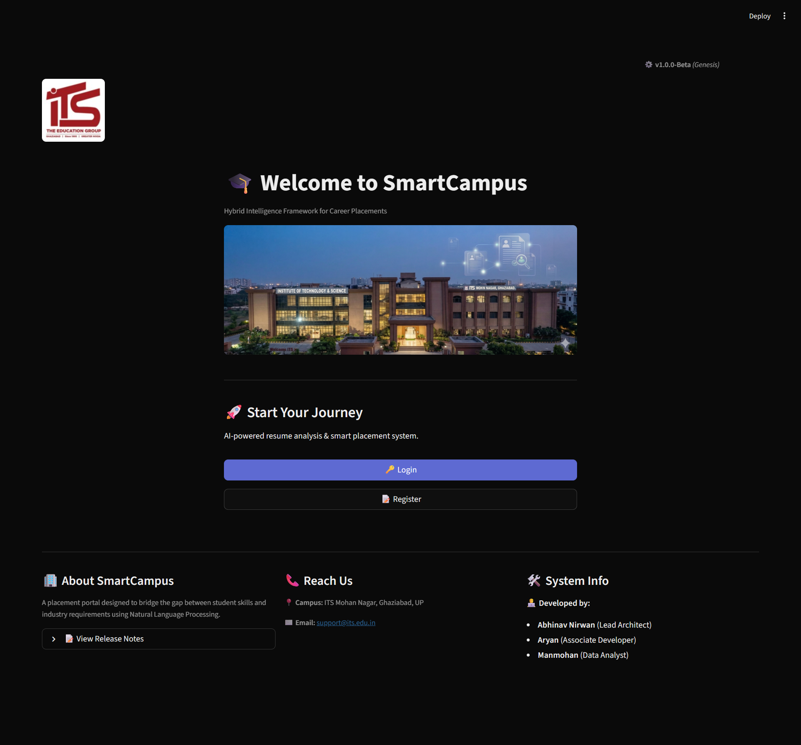
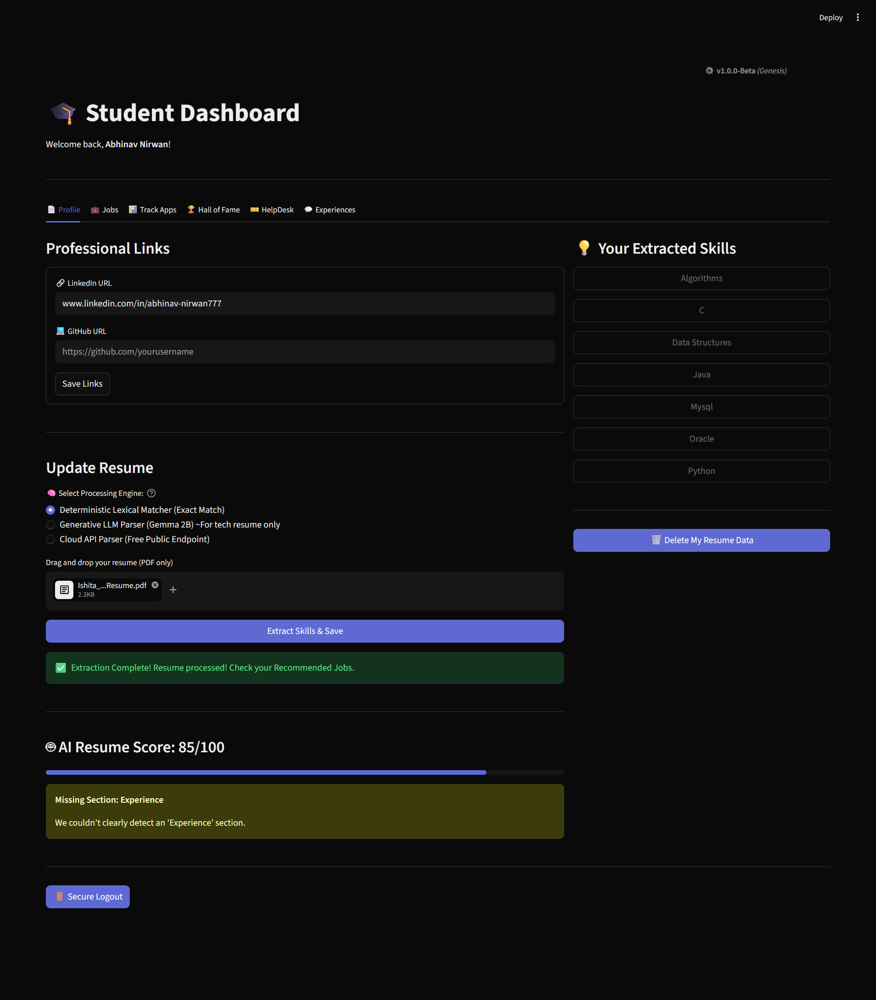
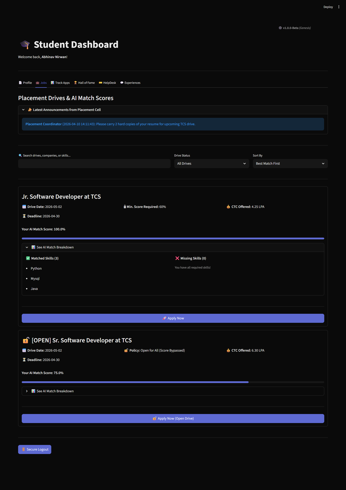
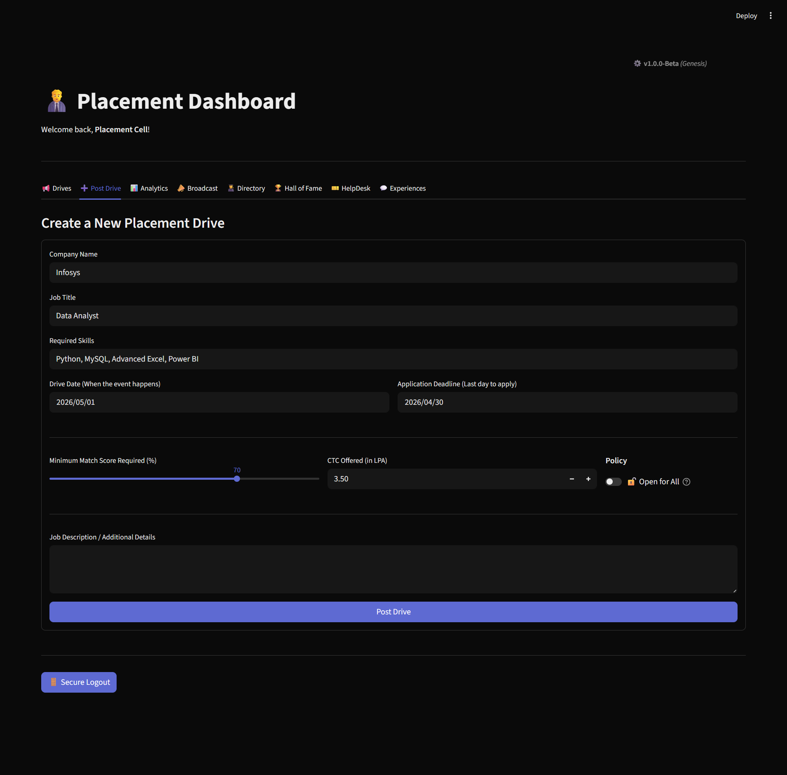
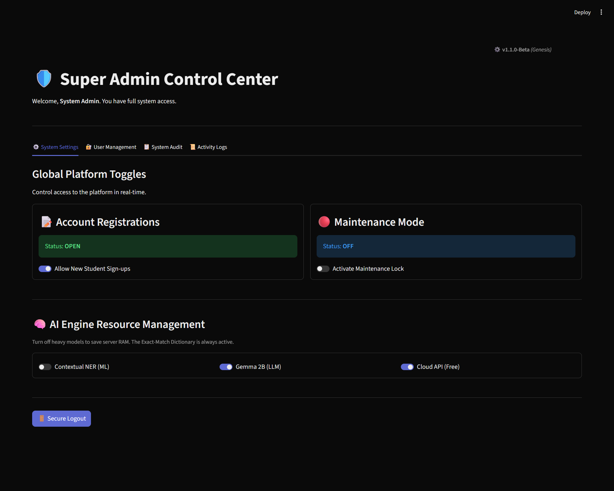

# SmartCampus: NLP-Driven Placement & Resume Matcher

🚀 **[Experience the Live Platform Here](https://smartcampus-its.streamlit.app)**

SmartCampus is an enterprise-grade Single Page Application that automates campus recruitment using O(1) mathematical Set Theory and Natural Language Processing...

## 🚀 Key Features
- **SmartScore Matching:** Exact-match and alias-mapped skill comparison.
- **NLP Resume Parsing:** Automated skill extraction using spaCy and Custom Lexical Matchers.
- **Secure Auth:** Domain-restricted registration (@its.edu.in) and session management.
- **Coordinator Dashboard:** Live analytics and campus-wide announcement system.

## 📸 UI & System Walkthrough

### 1. Main Portal

### 2. AI Resume Parsing & Student Profile

### 3. Smart Job Matching & Analytics

### 4. Placement Cell Controls & Admin Settings

## 🛠️ Tech Stack
- **Backend:** Python (Streamlit)
- **Database:** MySQL 8.0
- **NLP Engine:** spaCy (en_core_web_sm)
- **Logic Architecture:** Modular Python views

## 👥 The Team
| Name               | Role | Key Contributions |
|:-------------------| :--- | :--- |
| **Abhinav Nirwan** | **Systems Architect** | Master build engineering, NLP core, and system logic. |
| **Aryan Kumar**    | **Associate Developer** | Project prototyping and functional system testing. |
| **Manmohan Singh** | **Data Analyst** | Skills database curation and User Acceptance Testing (UAT). |